# RAG 知识库助手 - 系统架构文档

> **版本**: v1.0  
> **创建日期**: 2026-04-24  
> **文档状态**: 已发布  

---

## 目录

1. [整体架构](#一整体架构)
2. [后端架构](#二后端架构)
3. [前端架构](#三前端架构)
4. [数据流架构](#四数据流架构)
5. [RAG 流程架构](#五rag-流程架构)
6. [部署架构](#六部署架构)
7. [未来架构演进](#七未来架构演进)

---

## 一、整体架构

### 1.1 系统全景图

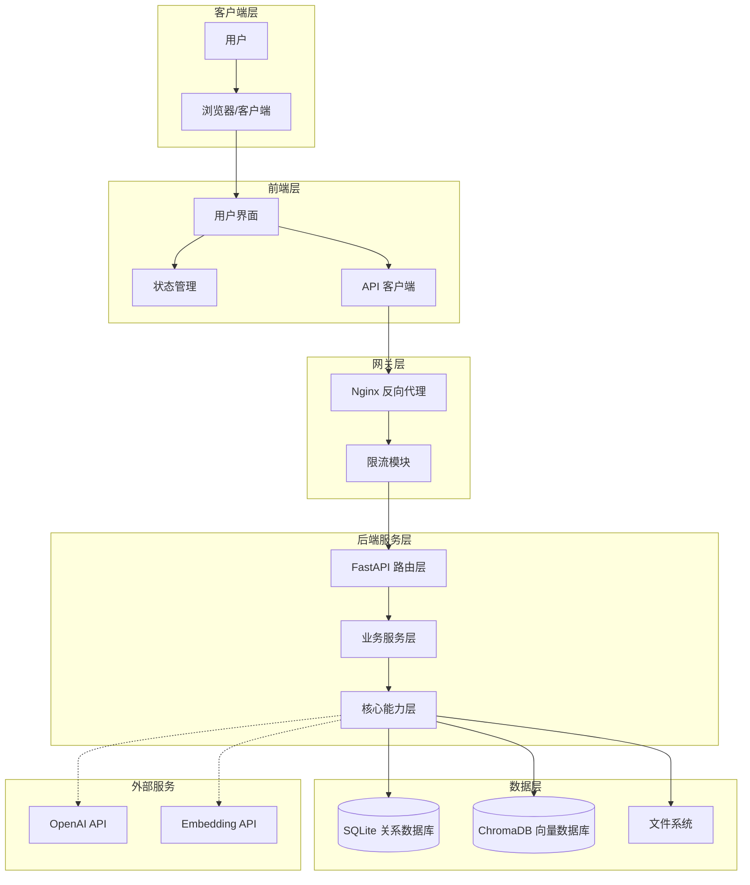
```mermaid
graph TB
    subgraph 客户端层
        User[用户]
        Browser[浏览器/客户端]
    end

    subgraph 前端层
        UI[用户界面]
        State[状态管理]
        API_Client[API 客户端]
    end

    subgraph 网关层
        Nginx[Nginx 反向代理]
        RateLimit[限流模块]
    end

    subgraph 后端服务层
        API[FastAPI 路由层]
        Service[业务服务层]
        Core[核心能力层]
    end

    subgraph 数据层
        SQLite[(SQLite 关系数据库)]
        ChromaDB[(ChromaDB 向量数据库)]
        FileSystem[文件系统]
    end

    subgraph 外部服务
        OpenAI[OpenAI API]
        Embedding[Embedding API]
    end

    User --> Browser
    Browser --> UI
    UI --> State
    UI --> API_Client
    API_Client --> Nginx
    Nginx --> RateLimit
    RateLimit --> API
    API --> Service
    Service --> Core
    Core --> SQLite
    Core --> ChromaDB
    Core --> FileSystem
    Core -.-> OpenAI
    Core -.-> Embedding
```

### 1.2 技术栈概览

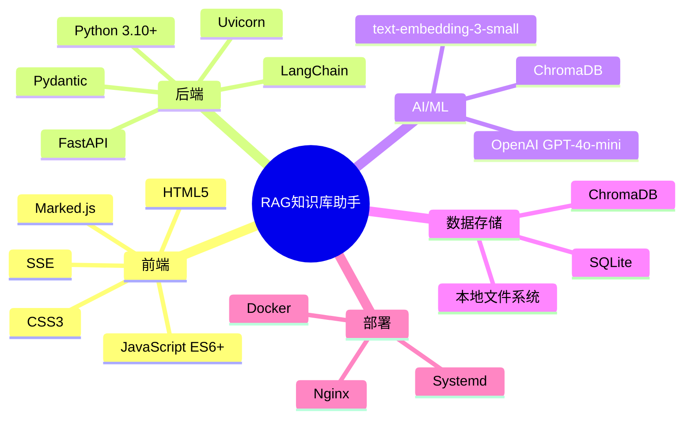
```mermaid
mindmap
  root((RAG知识库助手))
    前端
      HTML5
      CSS3
      JavaScript ES6+
      Marked.js
      SSE
    后端
      Python 3.10+
      FastAPI
      LangChain
      Pydantic
      Uvicorn
    AI/ML
      OpenAI GPT-4o-mini
      text-embedding-3-small
      ChromaDB
    数据存储
      SQLite
      ChromaDB
      本地文件系统
    部署
      Docker
      Nginx
      Systemd
```

---

## 二、后端架构

### 2.1 分层架构

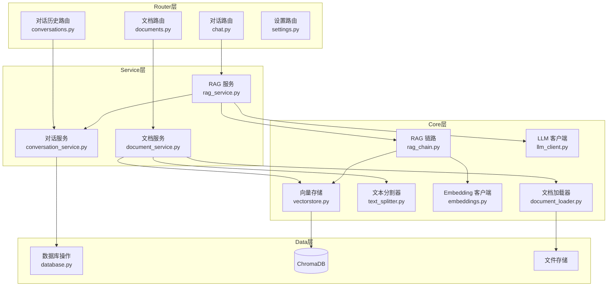
```mermaid
graph TB
    subgraph Router层
        DocRouter[文档路由<br/>documents.py]
        ChatRouter[对话路由<br/>chat.py]
        ConvRouter[对话历史路由<br/>conversations.py]
        SettingsRouter[设置路由<br/>settings.py]
    end

    subgraph Service层
        DocService[文档服务<br/>document_service.py]
        RAGService[RAG 服务<br/>rag_service.py]
        ConvService[对话服务<br/>conversation_service.py]
    end

    subgraph Core层
        DocLoader[文档加载器<br/>document_loader.py]
        TextSplitter[文本分割器<br/>text_splitter.py]
        Embeddings[Embedding 客户端<br/>embeddings.py]
        VectorStore[向量存储<br/>vectorstore.py]
        RAGChain[RAG 链路<br/>rag_chain.py]
        LLMClient[LLM 客户端<br/>llm_client.py]
    end

    subgraph Data层
        Database[数据库操作<br/>database.py]
        ChromaDB[(ChromaDB)]
        FileStorage[文件存储]
    end

    DocRouter --> DocService
    ChatRouter --> RAGService
    ConvRouter --> ConvService
    
    DocService --> DocLoader
    DocService --> TextSplitter
    DocService --> VectorStore
    
    RAGService --> RAGChain
    RAGService --> LLMClient
    RAGService --> ConvService
    
    RAGChain --> Embeddings
    RAGChain --> VectorStore
    
    DocLoader --> FileStorage
    VectorStore --> ChromaDB
    ConvService --> Database
```

### 2.2 模块依赖关系

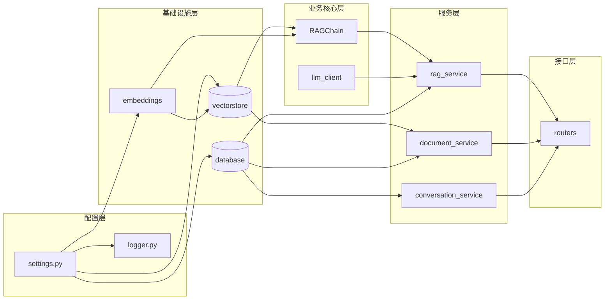
```mermaid
graph LR
    subgraph 配置层
        Settings[settings.py]
        Logger[logger.py]
    end

    subgraph 基础设施层
        DB[(database)]
        VS[(vectorstore)]
        Emb[embeddings]
    end

    subgraph 业务核心层
        RAG[RAGChain]
        LLM[llm_client]
    end

    subgraph 服务层
        RS[rag_service]
        DS[document_service]
        CS[conversation_service]
    end

    subgraph 接口层
        API[routers]
    end

    Settings --> Logger
    Settings --> DB
    Settings --> VS
    Settings --> Emb
    
    DB --> CS
    VS --> RAG
    Emb --> RAG
    Emb --> VS
    
    RAG --> RS
    LLM --> RS
    DB --> RS
    
    VS --> DS
    DB --> DS
    
    RS --> API
    DS --> API
    CS --> API
```

### 2.3 核心类图

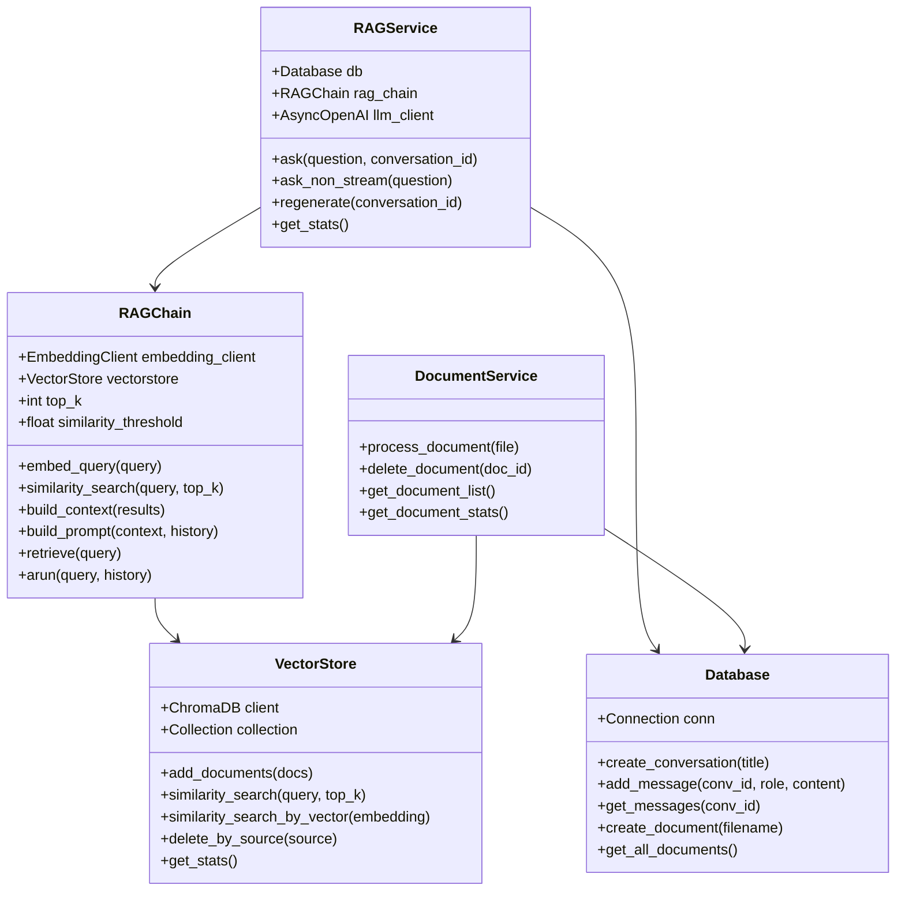
```mermaid
classDiagram
    class RAGChain {
        +EmbeddingClient embedding_client
        +VectorStore vectorstore
        +int top_k
        +float similarity_threshold
        +embed_query(query)
        +similarity_search(query, top_k)
        +build_context(results)
        +build_prompt(context, history)
        +retrieve(query)
        +arun(query, history)
    }

    class VectorStore {
        +ChromaDB client
        +Collection collection
        +add_documents(docs)
        +similarity_search(query, top_k)
        +similarity_search_by_vector(embedding)
        +delete_by_source(source)
        +get_stats()
    }

    class RAGService {
        +Database db
        +RAGChain rag_chain
        +AsyncOpenAI llm_client
        +ask(question, conversation_id)
        +ask_non_stream(question)
        +regenerate(conversation_id)
        +get_stats()
    }

    class DocumentService {
        +process_document(file)
        +delete_document(doc_id)
        +get_document_list()
        +get_document_stats()
    }

    class Database {
        +Connection conn
        +create_conversation(title)
        +add_message(conv_id, role, content)
        +get_messages(conv_id)
        +create_document(filename)
        +get_all_documents()
    }

    RAGService --> RAGChain
    RAGService --> Database
    RAGChain --> VectorStore
    DocumentService --> Database
    DocumentService --> VectorStore
```

---

## 三、前端架构

### 3.1 前端模块结构

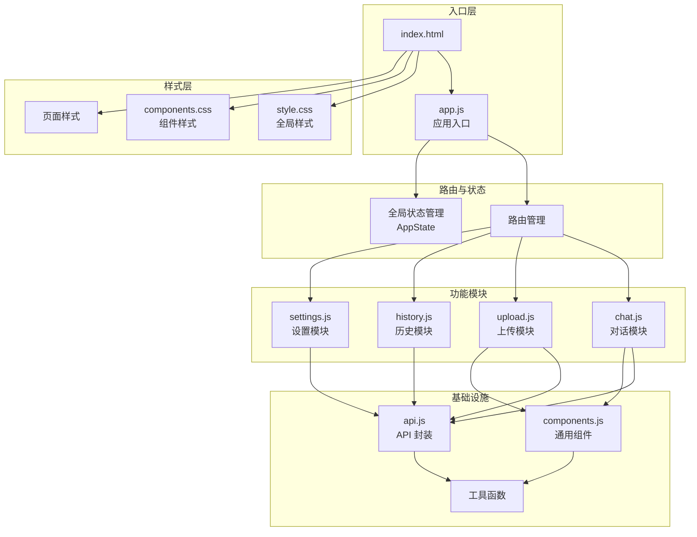
```mermaid
graph TB
    subgraph 入口层
        HTML[index.html]
        App[app.js<br/>应用入口]
    end

    subgraph 路由与状态
        Router[路由管理]
        State[全局状态管理<br/>AppState]
    end

    subgraph 功能模块
        Chat[chat.js<br/>对话模块]
        Upload[upload.js<br/>上传模块]
        History[history.js<br/>历史模块]
        Settings[settings.js<br/>设置模块]
    end

    subgraph 基础设施
        API[api.js<br/>API 封装]
        Components[components.js<br/>通用组件]
        Utils[工具函数]
    end

    subgraph 样式层
        GlobalCSS[style.css<br/>全局样式]
        ComponentCSS[components.css<br/>组件样式]
        PageCSS[页面样式]
    end

    HTML --> App
    App --> Router
    App --> State
    
    Router --> Chat
    Router --> Upload
    Router --> History
    Router --> Settings
    
    Chat --> API
    Upload --> API
    History --> API
    Settings --> API
    
    Chat --> Components
    Upload --> Components
    
    API --> Utils
    Components --> Utils
    
    HTML --> GlobalCSS
    HTML --> ComponentCSS
    HTML --> PageCSS
```

### 3.2 对话模块流程

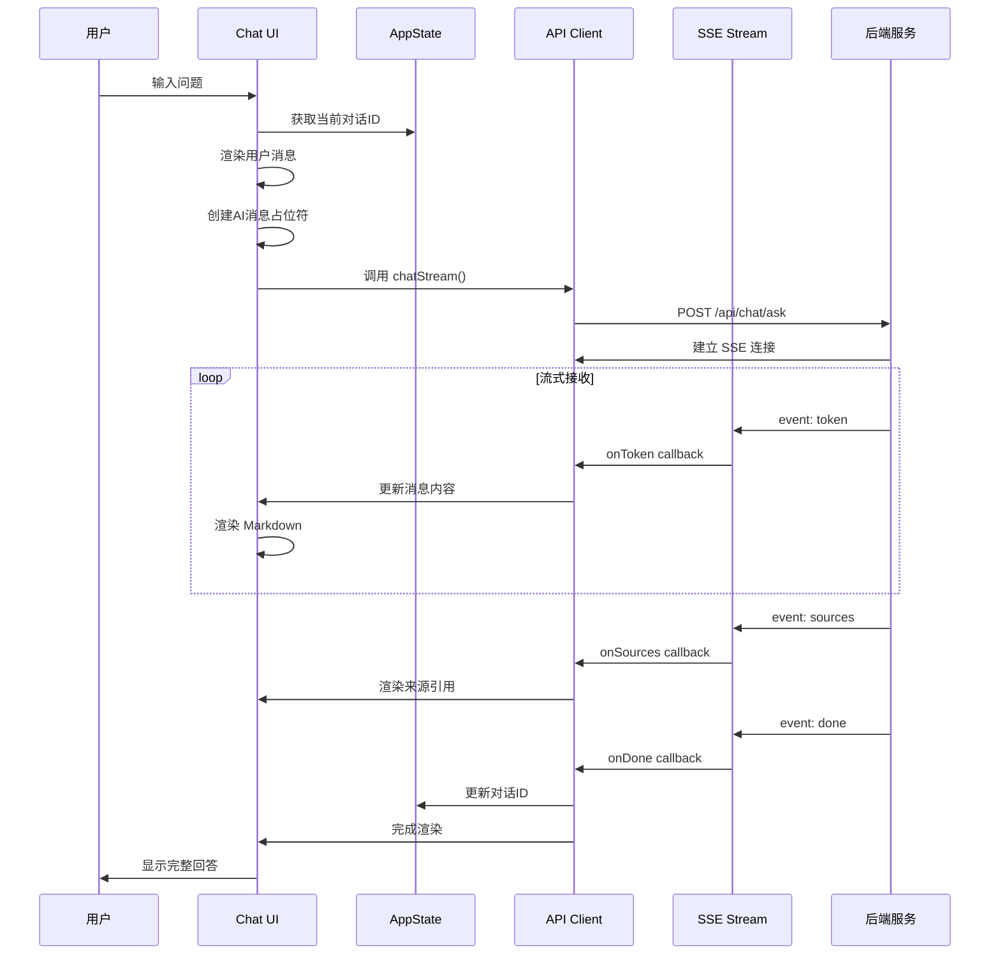
```mermaid
sequenceDiagram
    participant User as 用户
    participant UI as Chat UI
    participant State as AppState
    participant API as API Client
    participant SSE as SSE Stream
    participant Backend as 后端服务

    User->>UI: 输入问题
    UI->>State: 获取当前对话ID
    UI->>UI: 渲染用户消息
    UI->>UI: 创建AI消息占位符
    UI->>API: 调用 chatStream()
    API->>Backend: POST /api/chat/ask
    Backend->>API: 建立 SSE 连接
    
    loop 流式接收
        Backend->>SSE: event: token
        SSE->>API: onToken callback
        API->>UI: 更新消息内容
        UI->>UI: 渲染 Markdown
    end
    
    Backend->>SSE: event: sources
    SSE->>API: onSources callback
    API->>UI: 渲染来源引用
    
    Backend->>SSE: event: done
    SSE->>API: onDone callback
    API->>State: 更新对话ID
    API->>UI: 完成渲染
    UI->>User: 显示完整回答
```

---

## 四、数据流架构

### 4.1 文档处理流程

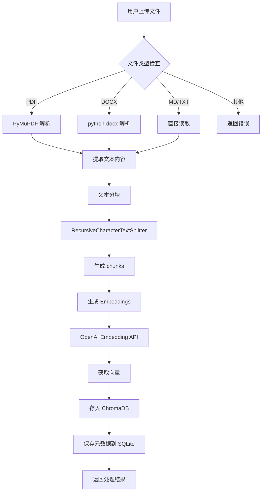
```mermaid
flowchart TD
    A[用户上传文件] --> B{文件类型检查}
    B -->|PDF| C[PyMuPDF 解析]
    B -->|DOCX| D[python-docx 解析]
    B -->|MD/TXT| E[直接读取]
    B -->|其他| F[返回错误]
    
    C --> G[提取文本内容]
    D --> G
    E --> G
    
    G --> H[文本分块]
    H --> I[RecursiveCharacterTextSplitter]
    I --> J[生成 chunks]
    
    J --> K[生成 Embeddings]
    K --> L[OpenAI Embedding API]
    L --> M[获取向量]
    
    M --> N[存入 ChromaDB]
    N --> O[保存元数据到 SQLite]
    O --> P[返回处理结果]
```

### 4.2 问答数据流

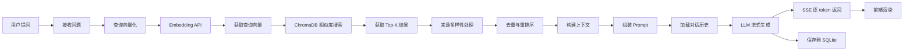
```mermaid
flowchart LR
    A[用户提问] --> B[接收问题]
    B --> C[查询向量化]
    C --> D[Embedding API]
    D --> E[获取查询向量]
    
    E --> F[ChromaDB 相似度搜索]
    F --> G[获取 Top-K 结果]
    
    G --> H[来源多样性处理]
    H --> I[去重与重排序]
    
    I --> J[构建上下文]
    J --> K[组装 Prompt]
    K --> L[加载对话历史]
    
    L --> M[LLM 流式生成]
    M --> N[SSE 逐 token 返回]
    N --> O[前端渲染]
    
    M --> P[保存到 SQLite]
```

### 4.3 数据存储架构

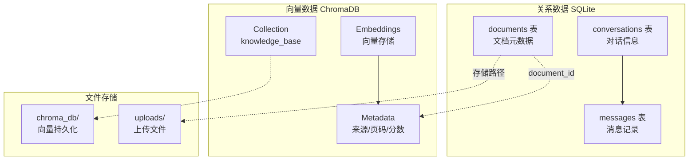
```mermaid
graph TB
    subgraph 关系数据 SQLite
        Documents[documents 表<br/>文档元数据]
        Conversations[conversations 表<br/>对话信息]
        Messages[messages 表<br/>消息记录]
    end

    subgraph 向量数据 ChromaDB
        Collection[Collection<br/>knowledge_base]
        Embeddings[Embeddings<br/>向量存储]
        Metadata[Metadata<br/>来源/页码/分数]
    end

    subgraph 文件存储
        Uploads[uploads/<br/>上传文件]
        ChromaPersist[chroma_db/<br/>向量持久化]
    end

    Documents -.->|document_id| Metadata
    Conversations --> Messages
    Embeddings --> Metadata
    
    Documents -.->|存储路径| Uploads
    Collection -.-> ChromaPersist
```

---

## 五、RAG 流程架构

### 5.1 完整 RAG 链路

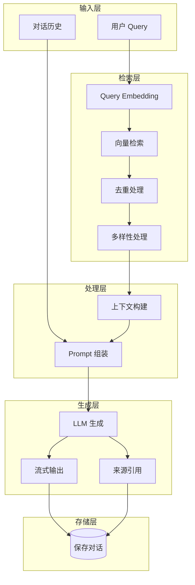
```mermaid
flowchart TD
    subgraph 输入层
        Q[用户 Query]
        H[对话历史]
    end

    subgraph 检索层
        E[Query Embedding]
        VS[向量检索]
        D[去重处理]
        Div[多样性处理]
    end

    subgraph 处理层
        C[上下文构建]
        P[Prompt 组装]
    end

    subgraph 生成层
        LLM[LLM 生成]
        S[流式输出]
        Src[来源引用]
    end

    subgraph 存储层
        DB[(保存对话)]
    end

    Q --> E
    E --> VS
    VS --> D
    D --> Div
    Div --> C
    H --> P
    C --> P
    P --> LLM
    LLM --> S
    LLM --> Src
    S --> DB
    Src --> DB
```

### 5.2 RAGChain 内部流程

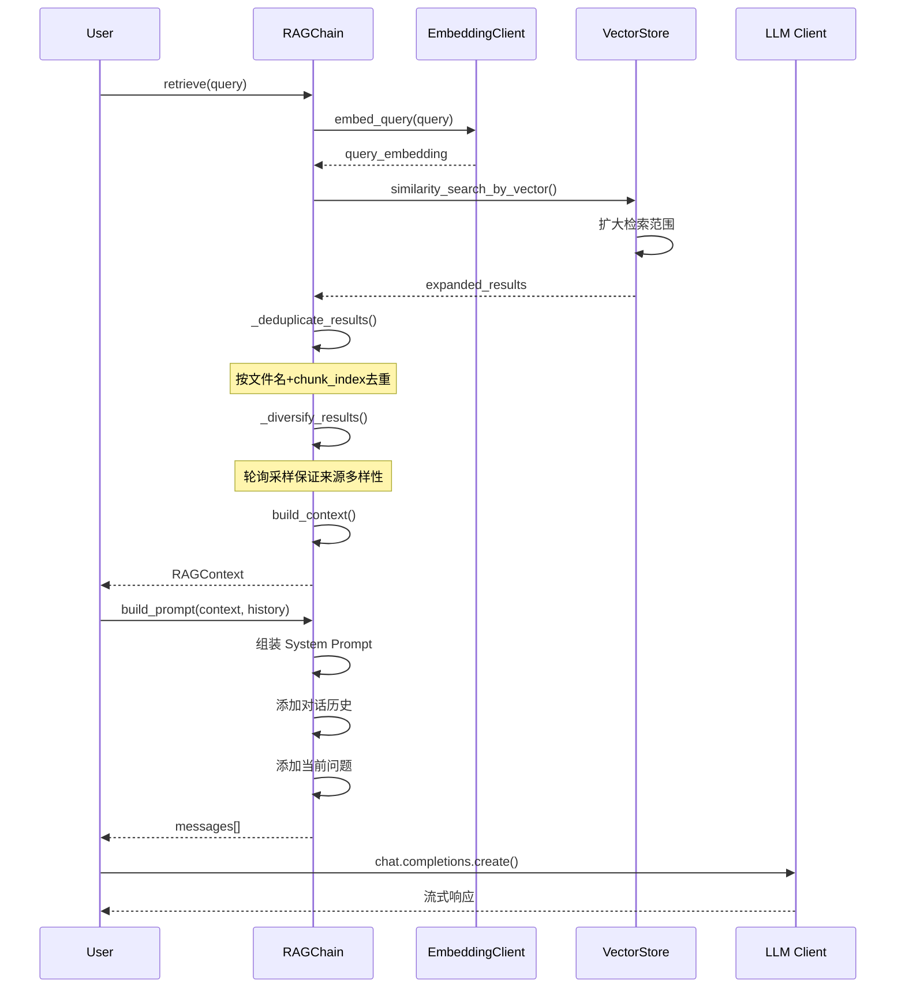
```mermaid
sequenceDiagram
    participant User
    participant RAG as RAGChain
    participant Emb as EmbeddingClient
    participant VS as VectorStore
    participant LLM as LLM Client

    User->>RAG: retrieve(query)
    RAG->>Emb: embed_query(query)
    Emb-->>RAG: query_embedding
    
    RAG->>VS: similarity_search_by_vector()
    VS->>VS: 扩大检索范围
    VS-->>RAG: expanded_results
    
    RAG->>RAG: _deduplicate_results()
    Note over RAG: 按文件名+chunk_index去重
    
    RAG->>RAG: _diversify_results()
    Note over RAG: 轮询采样保证来源多样性
    
    RAG->>RAG: build_context()
    RAG-->>User: RAGContext
    
    User->>RAG: build_prompt(context, history)
    RAG->>RAG: 组装 System Prompt
    RAG->>RAG: 添加对话历史
    RAG->>RAG: 添加当前问题
    RAG-->>User: messages[]
    
    User->>LLM: chat.completions.create()
    LLM-->>User: 流式响应
```

### 5.3 检索优化策略

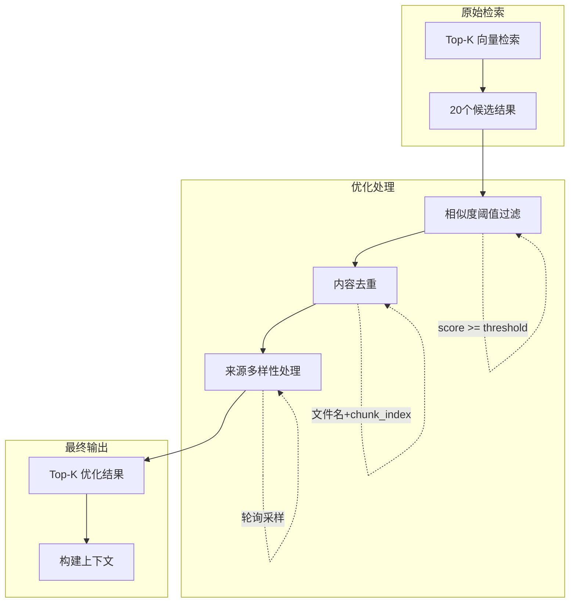
```mermaid
graph TB
    subgraph 原始检索
        A[Top-K 向量检索] --> B[20个候选结果]
    end

    subgraph 优化处理
        B --> C[相似度阈值过滤]
        C --> D[内容去重]
        D --> E[来源多样性处理]
    end

    subgraph 最终输出
        E --> F[Top-K 优化结果]
        F --> G[构建上下文]
    end

    C -.->|score >= threshold| C
    D -.->|文件名+chunk_index| D
    E -.->|轮询采样| E
```

---

## 六、部署架构

### 6.1 单机部署架构

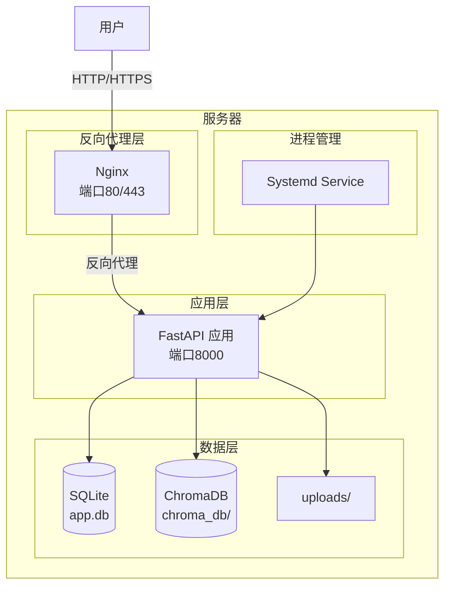
```mermaid
graph TB
    subgraph 服务器
        subgraph 反向代理层
            Nginx[Nginx<br/>端口80/443]
        end

        subgraph 应用层
            FastAPI[FastAPI 应用<br/>端口8000]
        end

        subgraph 数据层
            SQLite[(SQLite<br/>app.db)]
            ChromaDB[(ChromaDB<br/>chroma_db/)]
            Files[uploads/]
        end

        subgraph 进程管理
            Systemd[Systemd Service]
        end
    end

    User[用户] -->|HTTP/HTTPS| Nginx
    Nginx -->|反向代理| FastAPI
    FastAPI --> SQLite
    FastAPI --> ChromaDB
    FastAPI --> Files
    Systemd --> FastAPI
```

### 6.2 Docker 部署架构

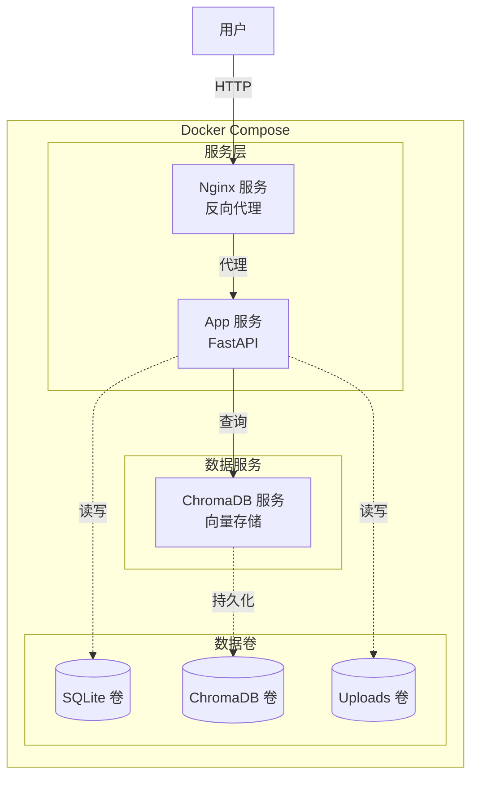
```mermaid
graph TB
    subgraph Docker Compose
        subgraph 服务层
            App[App 服务<br/>FastAPI]
            Nginx[Nginx 服务<br/>反向代理]
        end

        subgraph 数据服务
            Chroma[ChromaDB 服务<br/>向量存储]
        end

        subgraph 数据卷
            SQLite[(SQLite 卷)]
            ChromaData[(ChromaDB 卷)]
            Uploads[(Uploads 卷)]
        end
    end

    User[用户] -->|HTTP| Nginx
    Nginx -->|代理| App
    App -->|查询| Chroma
    App -.->|读写| SQLite
    App -.->|读写| Uploads
    Chroma -.->|持久化| ChromaData
```

### 6.3 生产环境架构（未来）

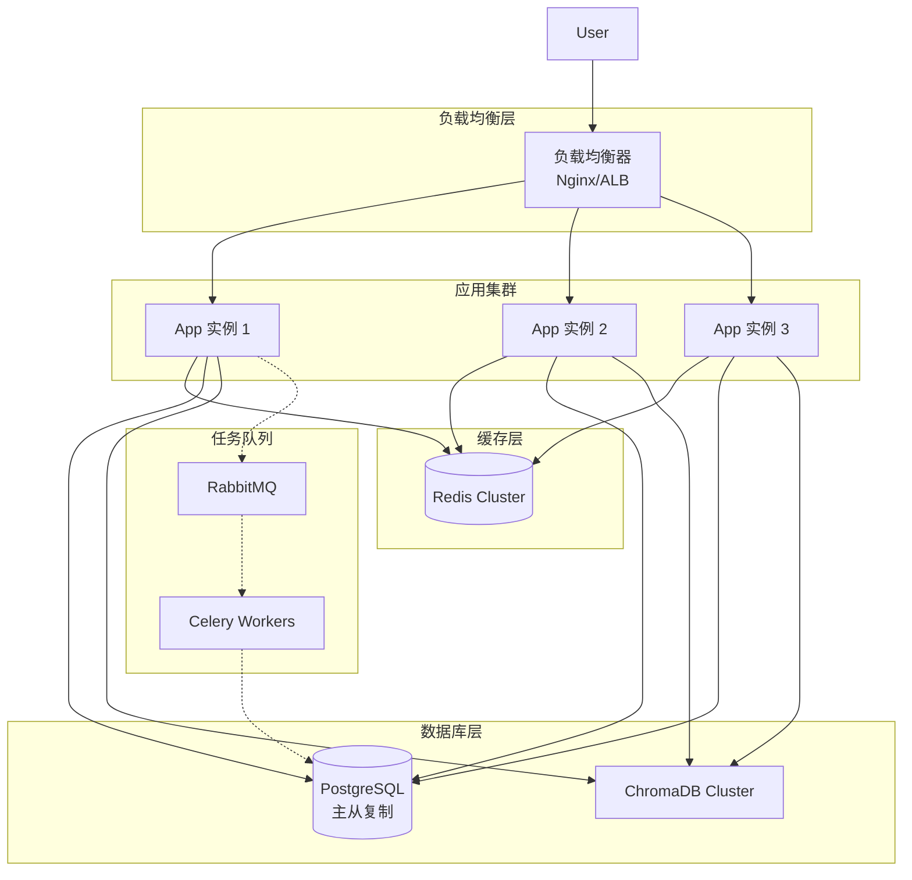
```mermaid
graph TB
    subgraph 负载均衡层
        LB[负载均衡器<br/>Nginx/ALB]
    end

    subgraph 应用集群
        App1[App 实例 1]
        App2[App 实例 2]
        App3[App 实例 3]
    end

    subgraph 缓存层
        Redis[(Redis Cluster)]
    end

    subgraph 数据库层
        PostgreSQL[(PostgreSQL<br/>主从复制)]
        ChromaCluster[ChromaDB Cluster]
    end

    subgraph 任务队列
        Celery[Celery Workers]
        RabbitMQ[RabbitMQ]
    end

    User --> LB
    LB --> App1
    LB --> App2
    LB --> App3
    
    App1 --> Redis
    App2 --> Redis
    App3 --> Redis
    
    App1 --> PostgreSQL
    App2 --> PostgreSQL
    App3 --> PostgreSQL
    
    App1 --> ChromaCluster
    App2 --> ChromaCluster
    App3 --> ChromaCluster
    
    App1 -.-> RabbitMQ
    RabbitMQ -.-> Celery
    Celery -.-> PostgreSQL
```

---

## 七、未来架构演进

### 7.1 微服务拆分规划

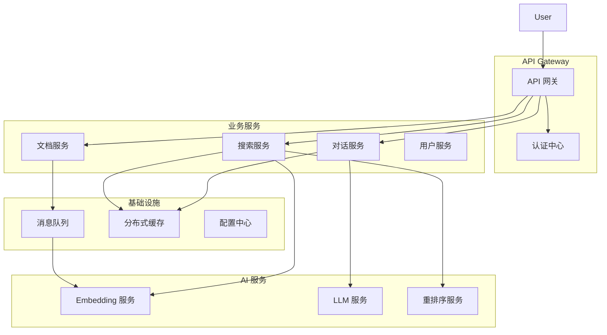
```mermaid
graph TB
    subgraph API Gateway
        Gateway[API 网关]
        Auth[认证中心]
    end

    subgraph 业务服务
        ChatS[对话服务]
        DocS[文档服务]
        SearchS[搜索服务]
        UserS[用户服务]
    end

    subgraph AI 服务
        EmbeddingS[Embedding 服务]
        LLMS[LLM 服务]
        RerankS[重排序服务]
    end

    subgraph 基础设施
        MQ[消息队列]
        Cache[分布式缓存]
        Config[配置中心]
    end

    User --> Gateway
    Gateway --> Auth
    Gateway --> ChatS
    Gateway --> DocS
    Gateway --> SearchS
    
    ChatS --> LLMS
    SearchS --> EmbeddingS
    SearchS --> RerankS
    
    DocS --> MQ
    MQ --> EmbeddingS
    
    ChatS --> Cache
    SearchS --> Cache
```

### 7.2 Agent 架构演进

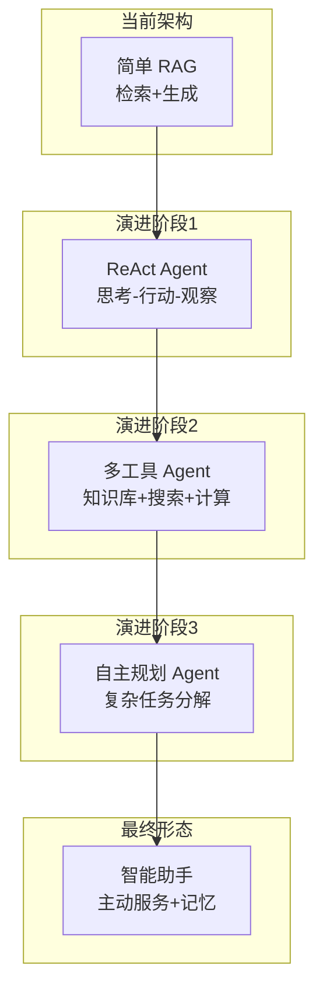
```mermaid
graph TB
    subgraph 当前架构
        Current[简单 RAG<br/>检索+生成]
    end

    subgraph 演进阶段1
        E1[ReAct Agent<br/>思考-行动-观察]
    end

    subgraph 演进阶段2
        E2[多工具 Agent<br/>知识库+搜索+计算]
    end

    subgraph 演进阶段3
        E3[自主规划 Agent<br/>复杂任务分解]
    end

    subgraph 最终形态
        Final[智能助手<br/>主动服务+记忆]
    end

    Current --> E1
    E1 --> E2
    E2 --> E3
    E3 --> Final
```

### 7.3 技术栈演进路线

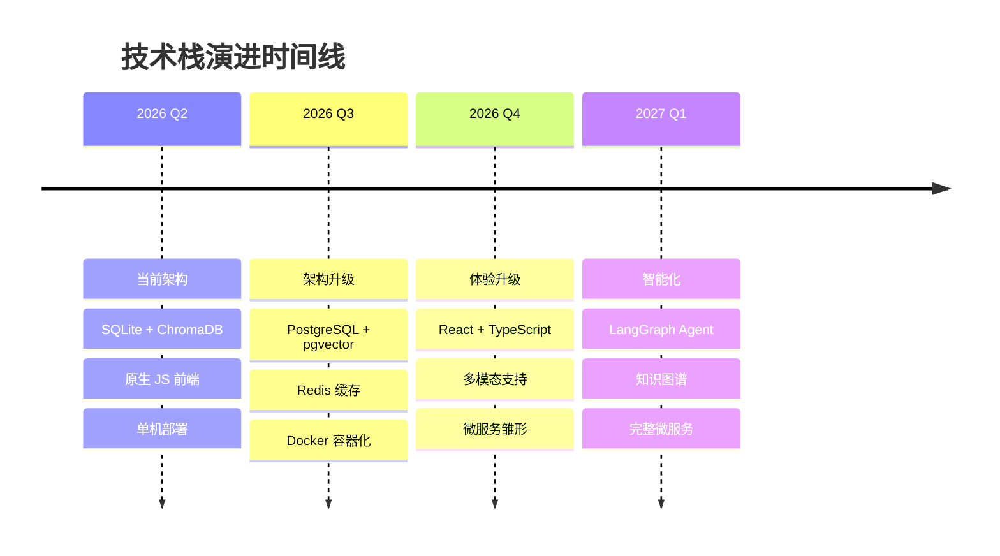
```mermaid
timeline
    title 技术栈演进时间线
    
    2026 Q2 : 当前架构
            : SQLite + ChromaDB
            : 原生 JS 前端
            : 单机部署
            
    2026 Q3 : 架构升级
            : PostgreSQL + pgvector
            : Redis 缓存
            : Docker 容器化
            
    2026 Q4 : 体验升级
            : React + TypeScript
            : 多模态支持
            : 微服务雏形
            
    2027 Q1 : 智能化
            : LangGraph Agent
            : 知识图谱
            : 完整微服务
```

---

## 附录

### A. 架构设计原则

1. **单一职责**: 每个模块只负责一个明确的功能
2. **依赖倒置**: 高层模块不依赖低层模块，都依赖抽象
3. **接口隔离**: 客户端不依赖不需要的接口
4. **开闭原则**: 对扩展开放，对修改关闭

### B. 参考资料

- [FastAPI 官方文档](https://fastapi.tiangolo.com/)
- [LangChain 架构指南](https://python.langchain.com/docs/concepts/)
- [RAG 最佳实践](https://www.pinecone.io/learn/retrieval-augmented-generation/)
- [Clean Architecture](https://blog.cleancoder.com/uncle-bob/2012/08/13/the-clean-architecture.html)

---

> **文档结束** - 本架构文档将随项目演进持续更新
