# RAG 知识库助手 - 未来发展规划

> **版本**: v1.0  
> **创建日期**: 2026-04-24  
> **文档状态**: 规划中  

---

## 目录

1. [项目愿景](#一项目愿景)
2. [现状分析](#二现状分析)
3. [发展路线图](#三发展路线图)
4. [Phase 1: 核心能力增强](#四phase-1-核心能力增强)
5. [Phase 2: 架构升级](#五phase-2-架构升级)
6. [Phase 3: 体验升级](#六phase-3-体验升级)
7. [Phase 4: 智能化升级](#七phase-4-智能化升级)
8. [Phase 5: 生态扩展](#八phase-5-生态扩展)
9. [技术债务与优化](#九技术债务与优化)
10. [资源与时间规划](#十资源与时间规划)

---

## 一、项目愿景

### 1.1 长期目标

将 RAG 知识库助手从**个人工具**演进为**智能知识管理平台**，成为：

- 🎯 **最懂用户的个人知识助手** - 深度理解用户需求，主动提供知识服务
- 🌐 **全平台知识中枢** - 整合分散在各处的知识资产
- 🤖 **具备 Agent 能力的智能体** - 不仅能回答，还能执行复杂任务
- 🔒 **安全可信的私有知识库** - 数据隐私优先，支持本地化部署

### 1.2 核心价值主张

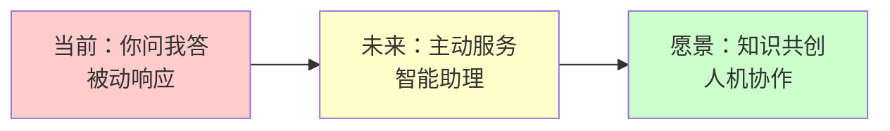

---

## 二、现状分析

### 2.1 当前能力矩阵

| 维度 | 当前状态 | 成熟度 |
|------|----------|--------|
| **文档处理** | 支持 PDF/Markdown/TXT/DOCX | ⭐⭐⭐ |
| **检索能力** | 向量相似度搜索 + 基础去重 | ⭐⭐⭐ |
| **对话能力** | 多轮对话 + 流式输出 | ⭐⭐⭐⭐ |
| **前端体验** | SPA 单页应用，原生 JS | ⭐⭐⭐ |
| **数据存储** | SQLite + ChromaDB | ⭐⭐ |
| **部署运维** | 单机部署 | ⭐⭐ |

### 2.2 技术债务

- [ ] 前端使用原生 JS，维护成本高
- [ ] SQLite 不适合高并发场景
- [ ] ChromaDB 单节点，扩展性受限
- [ ] 缺少完善的测试覆盖
- [ ] 文档处理是同步的，大文件会阻塞

### 2.3 机会点

- [ ] RAG 检索质量还有提升空间
- [ ] 缺少多模态能力（图片、语音）
- [ ] 无 Agent 和工具调用能力
- [ ] 用户体验可以更加智能化
- [ ] 企业级功能缺失（权限、审计）

---

## 三、发展路线图

### 3.1 整体规划概览

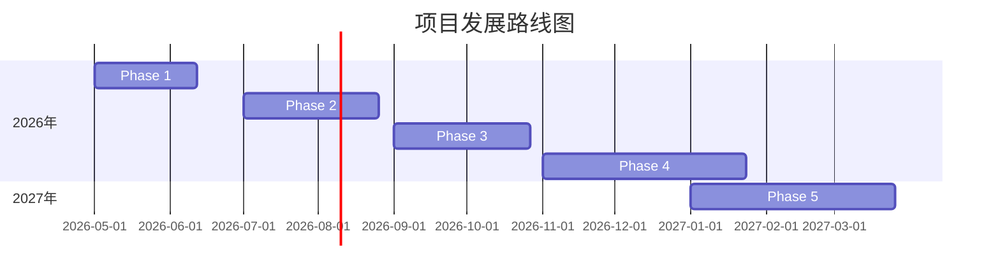

### 3.2 版本演进路线

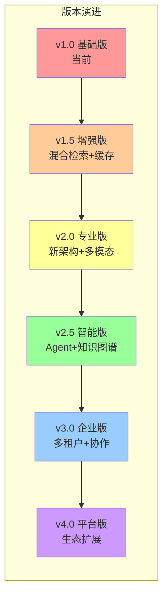

---

## 四、Phase 1: 核心能力增强

**时间**: 2026 Q2（6周）  
**目标**: 在不改变架构的前提下，最大化提升 RAG 效果

### 4.1 混合检索（Hybrid Search）

#### 4.1.1 目标
结合向量检索的语义理解能力和关键词检索的精确匹配能力，提升召回率 20%+

#### 4.1.2 技术方案

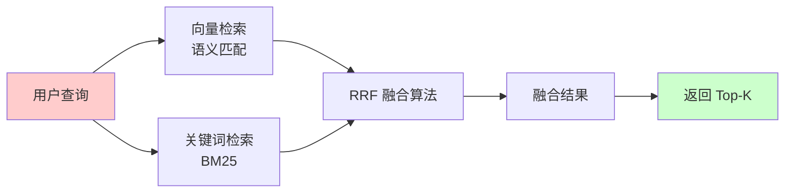

**代码实现**:

```python
# 混合检索流程
query = "什么是 RAG 技术？"

# 1. 向量检索（语义匹配）
vector_results = vectorstore.similarity_search(query, top_k=20)

# 2. 关键词检索（BM25）
keyword_results = bm25_search(query, top_k=20)

# 3. 结果融合（RRF - Reciprocal Rank Fusion）
fused_results = reciprocal_rank_fusion(vector_results, keyword_results, k=60)

# 4. 返回 Top-K
return fused_results[:top_k]
```

#### 4.1.3 实现步骤

- [ ] 集成 `rank-bm25` 或 `whoosh` 实现关键词检索
- [ ] 在 SQLite 中维护倒排索引表
- [ ] 实现 RRF 融合算法
- [ ] A/B 测试验证效果

**预计工时**: 1周

### 4.2 重排序（Reranking）

#### 4.2.1 目标
使用 Cross-Encoder 对初步检索结果进行精排，提升相关性

#### 4.2.2 技术方案

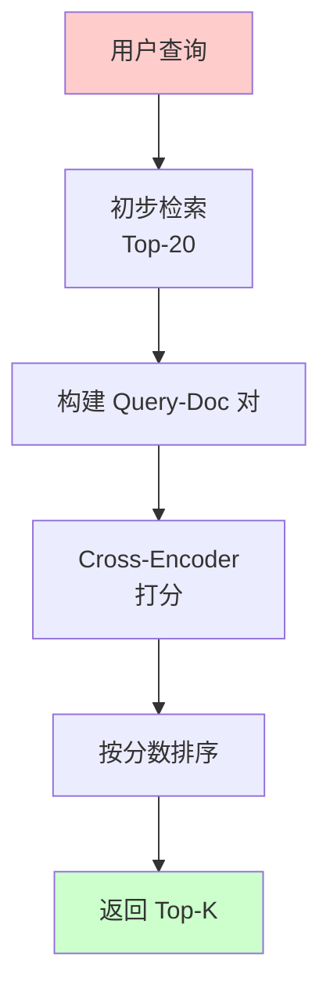

**代码实现**:

```python
from sentence_transformers import CrossEncoder

# 加载重排序模型
reranker = CrossEncoder('BAAI/bge-reranker-base')

# 重排序
pairs = [[query, doc.text] for doc in candidates]
scores = reranker.predict(pairs)

# 按分数重新排序
reranked = sorted(zip(candidates, scores), key=lambda x: x[1], reverse=True)
```

#### 4.2.3 模型选型

| 模型 | 大小 | 语言 | 适用场景 |
|------|------|------|----------|
| BAAI/bge-reranker-base | 1.5GB | 中英 | 通用场景，推荐 |
| BAAI/bge-reranker-large | 5GB | 中英 | 高精度需求 |
| mixedbread-ai/mxbai-rerank-xsmall-v1 | 100MB | 多语言 | 资源受限 |

**预计工时**: 1周

### 4.3 查询改写（Query Rewriting）

#### 4.3.1 HyDE（假设文档嵌入）

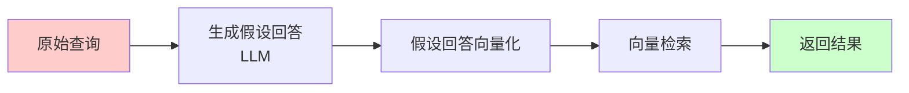

**代码实现**:

```python
# 1. 生成假设回答
hypothetical_answer = llm.generate(f"问题：{query}\n请生成一个简短的假设回答：")

# 2. 使用假设回答进行检索
query_embedding = embed(hypothetical_answer)
results = vectorstore.search_by_vector(query_embedding)
```

#### 4.3.2 查询扩展

```python
# 生成多个相关查询
expansion_prompt = f"""
问题：{query}
请生成 3 个语义相同但表述不同的问题：
1.
2.
3.
"""
expanded_queries = llm.generate(expansion_prompt)

# 多查询检索并融合
all_results = []
for q in [query] + expanded_queries:
    all_results.extend(vectorstore.search(q))

# 去重并返回
return deduplicate_and_rank(all_results)
```

**预计工时**: 1.5周

### 4.4 缓存系统

#### 4.4.1 多级缓存架构

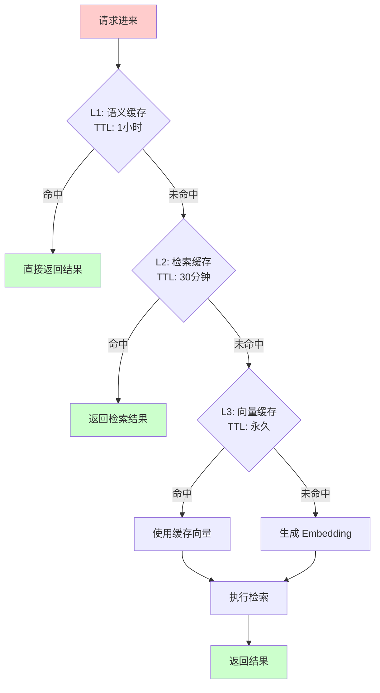

#### 4.4.2 Redis 集成

```python
import redis
from functools import wraps

redis_client = redis.Redis(host='localhost', port=6379, db=0)

def cache_response(ttl=3600):
    def decorator(func):
        @wraps(func)
        async def wrapper(query, *args, **kwargs):
            # 生成缓存键（基于查询语义）
            cache_key = f"rag:response:{hash(query)}"
            
            # 尝试获取缓存
            cached = redis_client.get(cache_key)
            if cached:
                return json.loads(cached)
            
            # 执行并缓存
            result = await func(query, *args, **kwargs)
            redis_client.setex(cache_key, ttl, json.dumps(result))
            return result
        return wrapper
    return decorator
```

**预计工时**: 1周

### 4.5 Phase 1 交付物

| 模块 | 文件 | 说明 |
|------|------|------|
| 混合检索 | `backend/core/hybrid_search.py` | RRF 融合算法实现 |
| 重排序 | `backend/core/reranker.py` | Cross-Encoder 封装 |
| 查询改写 | `backend/core/query_rewriter.py` | HyDE + 扩展 |
| 缓存 | `backend/core/cache.py` | Redis 缓存管理 |
| 配置 | `backend/config/settings.py` | 新增配置项 |

---

## 五、Phase 2: 架构升级

**时间**: 2026 Q3（8周）  
**目标**: 构建可扩展、高性能的技术架构

### 5.1 数据库升级

#### 5.1.1 PostgreSQL + pgvector 替换 SQLite

**迁移方案**:

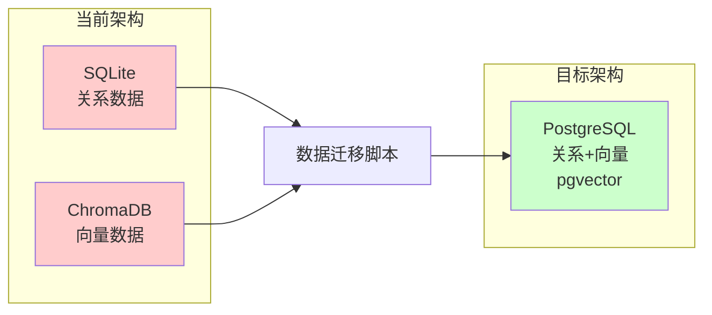

**代码实现**:

```python
# 新的数据库模型
from sqlalchemy import create_engine, Column, String, DateTime, JSON, Integer
from sqlalchemy.ext.declarative import declarative_base
from pgvector.sqlalchemy import Vector

Base = declarative_base()

class Document(Base):
    __tablename__ = 'documents'
    
    id = Column(String, primary_key=True)
    filename = Column(String, nullable=False)
    content = Column(String)
    embedding = Column(Vector(1536))  # pgvector 向量类型
    metadata = Column(JSON)
    created_at = Column(DateTime)
    
    # 全文搜索向量
    search_vector = Column(TSVectorType('content'))
```

**迁移步骤**:

1. 搭建 PostgreSQL + pgvector 环境
2. 编写数据迁移脚本
3. 双写验证（SQLite + PostgreSQL 同时写入）
4. 灰度切换
5. 下线 SQLite

**预计工时**: 2周

### 5.2 异步任务队列

#### 5.2.1 Celery 集成

```python
# tasks.py
from celery import Celery

app = Celery('rag_tasks', broker='redis://localhost:6379/0')

@app.task
def process_document(document_id: str, file_path: str):
    """异步处理文档"""
    # 1. 加载文档
    # 2. 分块
    # 3. 生成 Embedding
    # 4. 存入向量库
    pass

@app.task
def generate_summary(document_id: str):
    """异步生成文档摘要"""
    pass
```

#### 5.2.2 文档处理流程改造

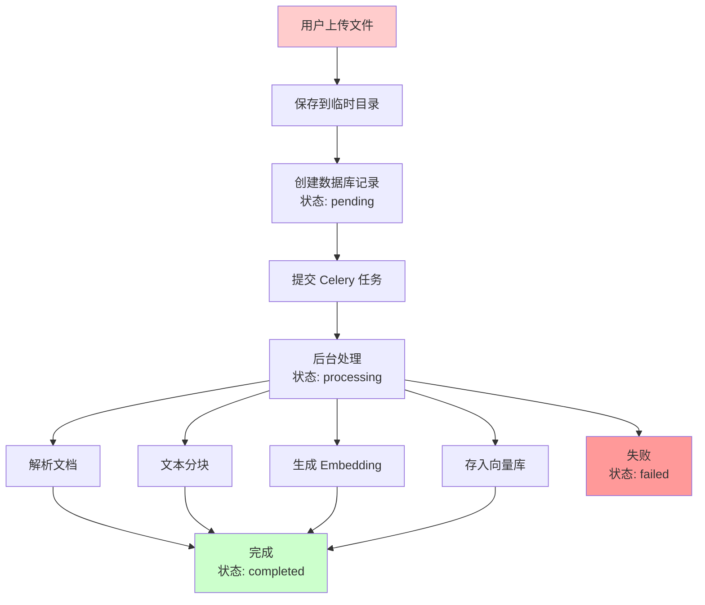

**预计工时**: 1.5周

### 5.3 Docker 容器化

#### 5.3.1 Docker Compose 架构

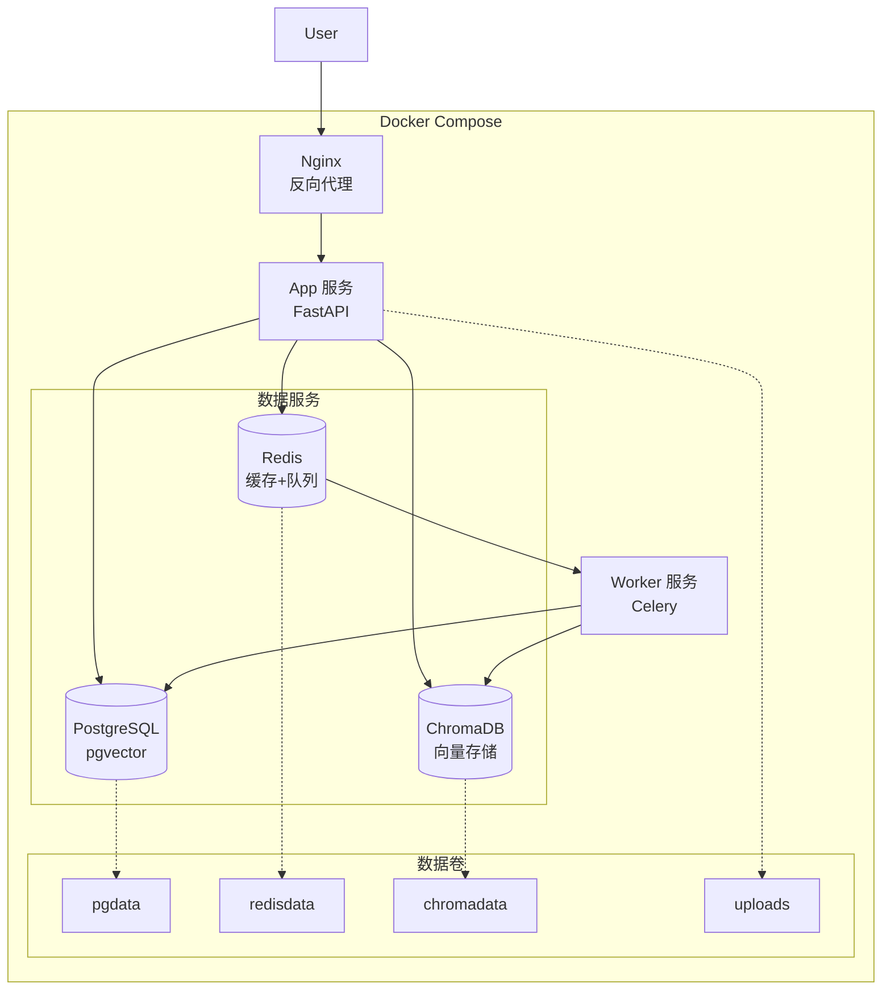

**预计工时**: 1周

### 5.4 API 网关与负载均衡

#### 5.4.1 Nginx 配置

```nginx
# nginx.conf
upstream backend {
    least_conn;
    server app1:8000;
    server app2:8000;
    server app3:8000;
}

server {
    listen 80;
    
    # 静态文件
    location / {
        root /app/frontend;
        try_files $uri $uri/ /index.html;
    }
    
    # API 代理
    location /api/ {
        proxy_pass http://backend/;
        proxy_set_header Host $host;
        proxy_set_header X-Real-IP $remote_addr;
        
        # SSE 支持
        proxy_buffering off;
        proxy_cache off;
    }
    
    # 限流
    location /api/chat/ask {
        limit_req zone=chat burst=5 nodelay;
        proxy_pass http://backend/api/chat/ask;
    }
}
```

**预计工时**: 1周

### 5.5 Phase 2 交付物

| 组件 | 文件/目录 | 说明 |
|------|-----------|------|
| PostgreSQL 模型 | `backend/db/models.py` | SQLAlchemy 模型定义 |
| 迁移脚本 | `scripts/migrate_to_postgres.py` | 数据迁移工具 |
| Celery 任务 | `backend/tasks/` | 异步任务定义 |
| Docker 配置 | `Dockerfile`, `docker-compose.yml` | 容器化配置 |
| Nginx 配置 | `nginx.conf` | 负载均衡配置 |

---

## 六、Phase 3: 体验升级

**时间**: 2026 Q4（8周）  
**目标**: 打造专业级的用户体验

### 6.1 前端技术栈升级

#### 6.1.1 React + TypeScript 重构

**技术选型**:

| 类别 | 技术 | 说明 |
|------|------|------|
| 框架 | React 18 | 函数组件 + Hooks |
| 语言 | TypeScript | 类型安全 |
| 样式 | TailwindCSS | 原子化 CSS |
| 组件库 | shadcn/ui | 现代化组件 |
| 状态管理 | Zustand | 轻量级状态管理 |
| 路由 | React Router v6 | 客户端路由 |
| HTTP 客户端 | TanStack Query | 数据获取与缓存 |
| 构建工具 | Vite | 快速构建 |

#### 6.1.2 项目结构

```
frontend-new/
├── src/
│   ├── components/          # 组件
│   │   ├── ui/             # 基础 UI 组件
│   │   ├── chat/           # 对话相关组件
│   │   ├── upload/         # 上传相关组件
│   │   └── settings/       # 设置相关组件
│   ├── hooks/              # 自定义 Hooks
│   ├── stores/             # 状态管理
│   ├── services/           # API 服务
│   ├── utils/              # 工具函数
│   ├── types/              # TypeScript 类型
│   └── App.tsx             # 应用入口
├── public/                 # 静态资源
└── package.json
```

**预计工时**: 3周

### 6.2 多模态支持

#### 6.2.1 多模态交互流程

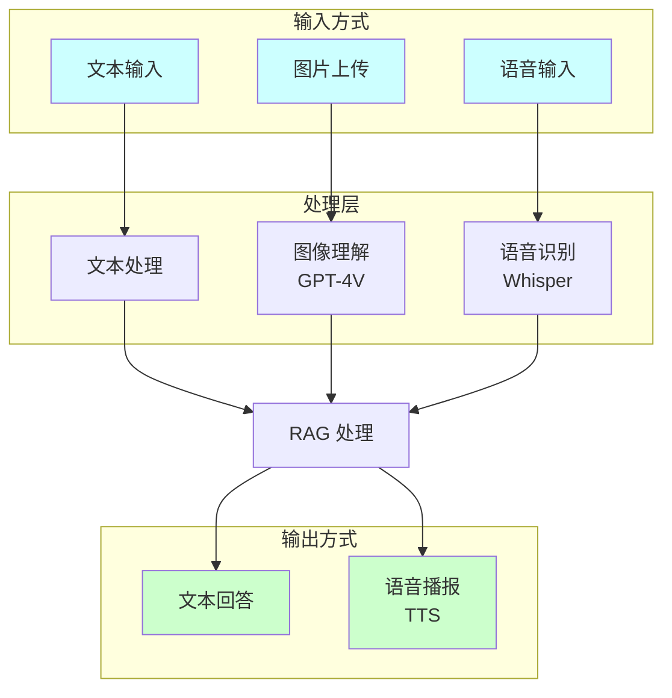

**预计工时**: 2周

### 6.3 高级交互功能

#### 6.3.1 思维导图生成

```typescript
// 使用 Markmap 或 D3.js 生成思维导图
import { Markmap } from 'markmap-view';

const generateMindMap = (markdown: string) => {
  // 将回答转换为 Markdown 列表格式
  const mindmapData = convertToMindmapFormat(markdown);
  
  // 渲染思维导图
  const svg = document.createElement('svg');
  const mm = Markmap.create(svg, {}, mindmapData);
};
```

#### 6.3.2 对话分支

```typescript
interface Message {
  id: string;
  role: 'user' | 'assistant';
  content: string;
  parentId?: string;      // 父消息 ID
  branches?: string[];    // 分支消息 IDs
}

// 从某条消息创建新分支
const createBranch = (messageId: string) => {
  const newConversationId = generateId();
  // 复制历史到新分支
  copyHistoryToBranch(currentConversationId, newConversationId, messageId);
};
```

**预计工时**: 1.5周

### 6.4 Phase 3 交付物

| 模块 | 说明 |
|------|------|
| `frontend-react/` | 全新 React 前端 |
| Vision API | 图片理解后端接口 |
| TTS/STT API | 语音合成与识别接口 |
| Mindmap Component | 思维导图组件 |
| Branch Management | 对话分支管理 |

---

## 七、Phase 4: 智能化升级

**时间**: 2027 Q1（12周）  
**目标**: 从问答工具进化为智能助手

### 7.1 Agent 架构

#### 7.1.1 ReAct Agent 流程

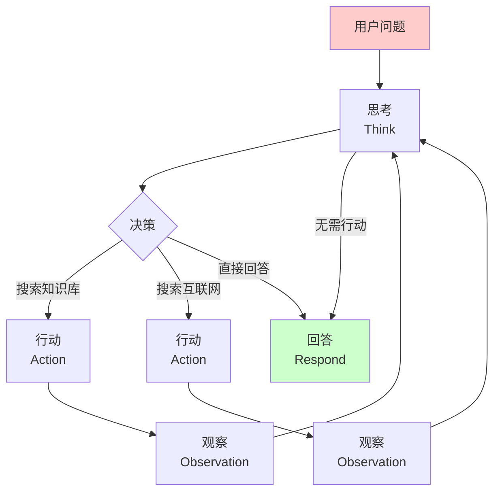

#### 7.1.2 ReAct Agent 实现

```python
from typing import TypedDict, Annotated
from langgraph.graph import StateGraph, END

class AgentState(TypedDict):
    question: str
    thought: str
    action: str
    observation: str
    answer: str
    steps: Annotated[list, lambda x, y: x + y]

def think(state: AgentState):
    """思考下一步行动"""
    prompt = f"""
    问题: {state['question']}
    历史: {state['steps']}
    
    思考下一步应该做什么：
    1. 搜索知识库
    2. 调用搜索引擎
    3. 直接回答
    """
    thought = llm.generate(prompt)
    return {"thought": thought}

def act(state: AgentState):
    """执行行动"""
    if "搜索" in state['thought']:
        observation = search_knowledge_base(state['question'])
    elif "搜索引擎" in state['thought']:
        observation = web_search(state['question'])
    else:
        observation = "可以直接回答"
    
    return {"observation": observation, "steps": [state['thought']]}

def respond(state: AgentState):
    """生成最终回答"""
    answer = llm.generate(f"基于以下信息回答问题：\n{state['observation']}")
    return {"answer": answer}

# 构建工作流
workflow = StateGraph(AgentState)
workflow.add_node("think", think)
workflow.add_node("act", act)
workflow.add_node("respond", respond)

workflow.set_entry_point("think")
workflow.add_edge("think", "act")
workflow.add_conditional_edges("act", should_continue, {
    "continue": "think",
    "end": "respond"
})
workflow.add_edge("respond", END)

agent = workflow.compile()
```

**预计工时**: 3周

### 7.2 知识图谱

#### 7.2.1 知识图谱构建流程

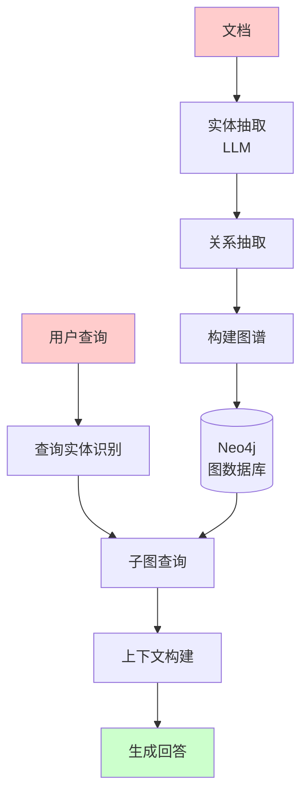

**预计工时**: 4周

### 7.3 个性化与记忆

#### 7.3.1 用户画像与记忆系统

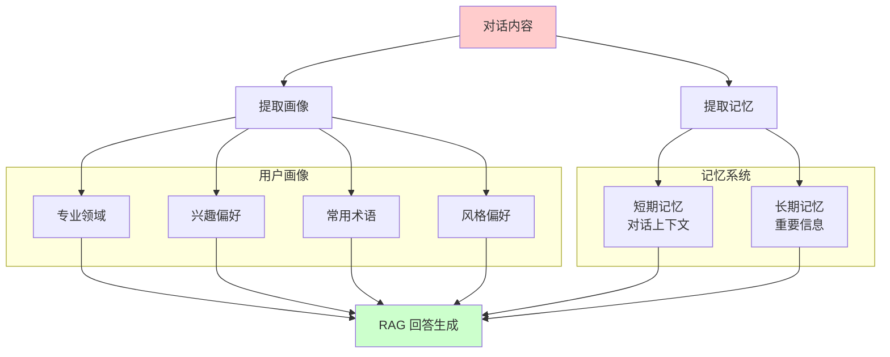

**预计工时**: 2周

### 7.4 Phase 4 交付物

| 模块 | 说明 |
|------|------|
| `backend/agent/` | Agent 核心架构 |
| `backend/tools/` | 工具集合 |
| `backend/graph/` | 知识图谱模块 |
| `backend/memory/` | 记忆系统 |
| LangGraph 工作流 | 可视化 Agent 编排 |

---

## 八、Phase 5: 生态扩展

**时间**: 2027 Q2-Q3（待定）  
**目标**: 构建完整的知识管理生态

### 8.1 第三方集成

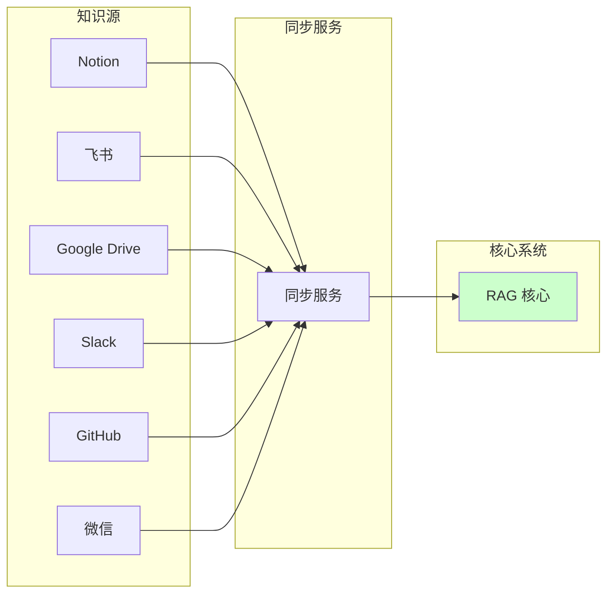

| 平台 | 集成内容 | 优先级 |
|------|----------|--------|
| Notion | 页面同步、数据库查询 | P0 |
| 飞书 | 文档、表格、消息 | P0 |
| Google Drive | 文件同步 | P1 |
| Slack | 消息索引、问答机器人 | P1 |
| GitHub | 代码仓库索引 | P2 |
| 微信 | 小程序、公众号 | P2 |

### 8.2 企业级功能

- **多租户支持**: 数据隔离、资源配额
- **SSO 单点登录**: OAuth2 / SAML / LDAP
- **审计日志**: 完整操作记录
- **权限管理**: RBAC 角色权限控制
- **协作功能**: 团队共享、评论、@提及

### 8.3 商业化能力

- **计费系统**: 按量付费、订阅制
- **API 开放平台**: 第三方开发者接入
- **插件市场**: 社区贡献插件

---

## 九、技术债务与优化

### 9.1 持续优化项

| 优化项 | 当前状态 | 目标 | 优先级 |
|--------|----------|------|--------|
| 测试覆盖率 | < 30% | > 80% | P0 |
| API 文档 | 基础 Swagger | 完整示例 + 教程 | P1 |
| 性能监控 | 无 | APM 全链路监控 | P1 |
| 代码质量 | 良好 | 卓越（Sonar A 级） | P2 |
| 文档完善 | 基础 | 完整开发者文档 | P2 |

### 9.2 性能目标

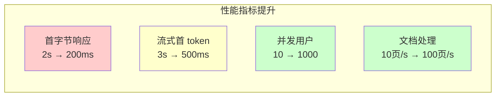

| 指标 | 当前 | Phase 2 目标 | Phase 3 目标 |
|------|------|--------------|--------------|
| 首字节响应 | 2s | 500ms | 200ms |
| 流式首 token | 3s | 1s | 500ms |
| 并发用户 | 10 | 100 | 1000 |
| 文档处理速度 | 10页/秒 | 50页/秒 | 100页/秒 |

---

## 十、资源与时间规划

### 10.1 人力规划

| 角色 | 人数 | 职责 |
|------|------|------|
| 后端工程师 | 2 | 架构、API、AI 逻辑 |
| 前端工程师 | 1-2 | React 重构、交互优化 |
| AI 工程师 | 1 | RAG 优化、Agent 开发 |
| 产品经理 | 0.5 | 需求、设计、验收 |
| 测试工程师 | 0.5 | 测试、质量保障 |

### 10.2 时间线汇总

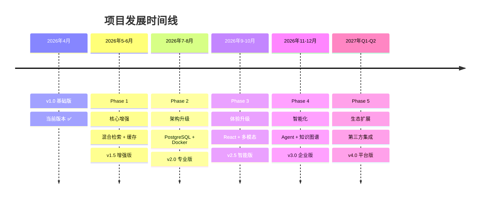

### 10.3 里程碑检查点

| 里程碑 | 日期 | 成功标准 |
|--------|------|----------|
| M1 | 2026-06-30 | RAG 准确率提升 20%，响应速度提升 50% |
| M2 | 2026-08-31 | 完成架构升级，支持 100 并发 |
| M3 | 2026-10-31 | 新前端上线，用户满意度 > 4.5/5 |
| M4 | 2026-12-31 | Agent 上线，支持 5+ 工具 |
| M5 | 2027-03-31 | 企业版发布，支持多租户 |

---

## 附录

### A. 技术选型参考

| 类别 | 选项1 | 选项2 | 选项3 |
|------|-------|-------|-------|
| 向量数据库 | pgvector | Milvus | Pinecone |
| 缓存 | Redis | Memcached | - |
| 消息队列 | Redis | RabbitMQ | Kafka |
| 前端框架 | React | Vue | Svelte |
| Agent 框架 | LangGraph | AutoGen | CrewAI |
| 图谱数据库 | Neo4j | NebulaGraph | Dgraph |

### B. 参考资源

- [LangChain 文档](https://python.langchain.com/)
- [RAG Survey Paper](https://arxiv.org/abs/2312.10997)
- [OpenAI Best Practices](https://platform.openai.com/docs/guides)
- [FastAPI 最佳实践](https://fastapi.tiangolo.com/)

---

> **文档结束** - 本规划将根据实际开发进度和市场反馈持续调整
